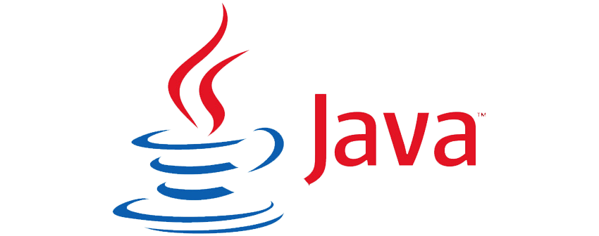

# Hi I'm Utku ✋
## 💫 I love math, backend programming, software testing tools and RC vehicles

## 🧠 I'm currently learning Java, Python

 

## My Interests
- 📟 Arduino
- 🪐 Space
- ⚛️ Automation Projects
- 🕹️ Simulations

 

|  ⭐  Languages & Frameworks & Tools                  |
|:---------------------------: |
|     Selenium, JUnit, TestNG, Cucumber, Maven |
|   Flask, PyQt5,                            |
|      |

 

## I'm always available for a project friend 👏
<!-- -->

| Tables   |      Are      |  Cool |
|----------|:-------------:|------:|
| col 1 is |  left-aligned | $1600 |
| col 2 is |    centered   |   $12 |
| col 3 is | right-aligned |    $1 |
